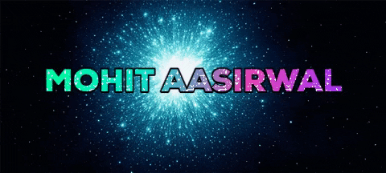

<h1 align="center">Hola! Soy  

 </h1>
<h3 align="center">A Cosmology Geek and Technology Enthusiast...</h3>

 

  

  

- 🔭 I’m currently working on **Vasudha Astronomy Club Website**

- 🌱 I’m currently learning **Full-Stack Development and JAVA programming language.**

- 👯 I’m looking to collaborate on **Frontend Development**

- 🤝 I’m looking for help with **Backend Development**

- 👨‍💻 All of my projects are available at [www.github.com/mohit-aasirwal](www.github.com/mohit-aasirwal)

- 📝 I regularly write articles on [https://www.linkedin.com/in/mohit-aasirwal-478466223/](https://www.linkedin.com/in/mohit-aasirwal-478466223/)

- 💬 Ask me about **expressJS, ReactJS, NextJS, MongoDB etc. Web technologies**

- 📫 How to reach me **mohitaasirwal@gmail.com**

- ⚡ Fun fact **I think I am resourceful.**
 

  I am very keen in <em>Astronomy and Technology</em>.
  I am currently pursuing <strong>Bachelor of Engineering</strong> in  <b>INFORMATION TECHNOLOGY</b> from <u>IET-DAVV</u>(Indore).
My Current learnings include Full Stack MERN development and C++ programming language.I am currently learning DATA STRUCTURES AND ALGORITHMS in JAVA.

<h3 align="left">Connect with me:</h3>

<h3 align="left">Languages and Tools:</h3>

                     

&nbsp;

 

 

<h1 align='center'>Hacktoberfest 2022 </h1> 

<h2>Also checkout My Youtube work :</h2>
<a href="https://www.youtube.com/channel/UCj_0k9FSTb8Wzz60Mqlbc6A" alt="Techy Mohit">Techy Mohit</a>

<!--
**Mohit-Aasirwal/Mohit-Aasirwal** is a ✨ _special_ ✨ repository because its `README.md` (this file) appears on your GitHub profile.

Here are some ideas to get you started:

- 🔭 I’m currently working on ...
- 🌱 I’m currently learning ...
- 👯 I’m looking to collaborate on ...
- 🤔 I’m looking for help with ...
- 💬 Ask me about ...
- 📫 How to reach me: ...
- 😄 Pronouns: ...
- ⚡ Fun fact: ...
-->
